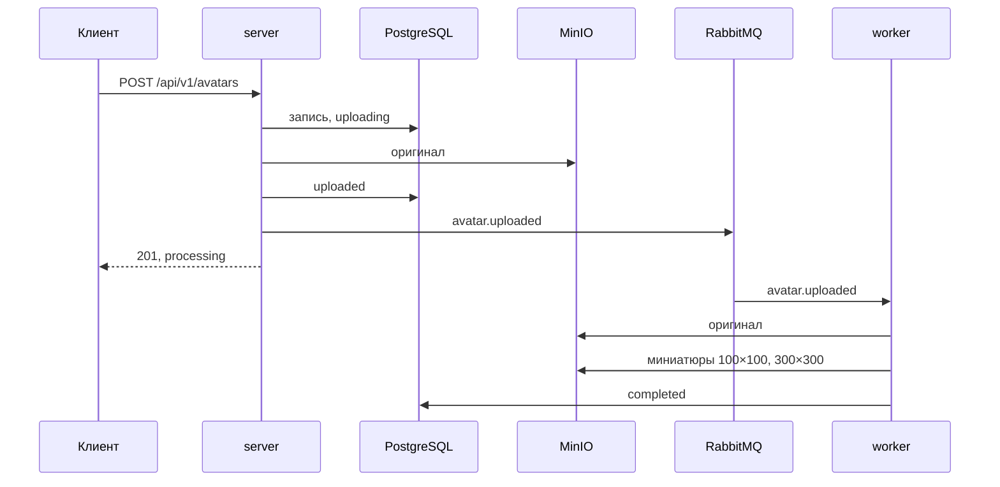
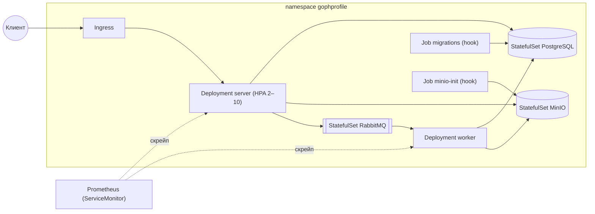

# GophProfile

Сервис аватарок. Пользователь загружает фото один раз; сторонние платформы
запрашивают его по `user_id` в нужном размере. Оригинал хранится в S3-совместимом
хранилище, миниатюры 100×100 и 300×300 создаются асинхронно; если аватара нет,
отдаётся встроенная заглушка.

Полная спецификация — [spec.md](spec.md): форматы ответов, модель данных,
топология брокера.

## Устройство

Три бинарника вокруг PostgreSQL, MinIO и RabbitMQ:

- **server** — REST API: пишет метаданные в PostgreSQL, кладёт оригинал в MinIO,
  публикует событие в RabbitMQ.
- **worker** — потребляет события: создаёт миниатюры, убирает файлы удалённых
  аватаров, переопубликовывает зависшие загрузки.
- **migrator** — применяет миграции и выходит. Server и worker DDL не выполняют:
  при параллельном старте они гонялись бы друг с другом за блокировки.

Напрямую server и worker не общаются — только через базу и брокер.



Ошибки обработки уходят на лестницу retry-очередей, после пяти попыток — в DLQ.

## Запуск

Нужен Docker:

```sh
make up
```

Compose поднимает PostgreSQL, MinIO и RabbitMQ, прогоняет миграции, создаёт бакет
и запускает server с worker. После старта:

- API — http://localhost:8080
- консоль MinIO — http://localhost:9001
- management RabbitMQ — http://localhost:15672

Конфигурация — через переменные окружения, все описаны в
[.env.example](.env.example). У секретов (`DATABASE_DSN`, `S3_ACCESS_KEY`,
`S3_SECRET_KEY`, `AMQP_URL`) значений по умолчанию нет — без них бинарник падает
на старте. Compose файл `.env` подхватывает сам; бинарники читают только окружение
процесса, поэтому при запуске напрямую переменные нужно экспортировать.

## Деплой в Kubernetes

Helm Chart [deploy/charts/gophprofile](deploy/charts/gophprofile):
server под HPA, worker, миграции hook'ом, NetworkPolicy и Pod Security
Standards `restricted`. В dev-режиме chart поднимает PostgreSQL, MinIO
и RabbitMQ минимальными StatefulSet'ами; в prod инфраструктура внешняя.
Команды установки и values окружений — в
[README chart'а](deploy/charts/gophprofile/README.md). Compose остаётся
способом локального запуска без кластера.



Сетевые границы: default deny в обе стороны, разрешены только показанные
стрелки, ingress от ingress-контроллера и Prometheus, DNS.

## API

Формальное описание — [api/openapi.yaml](api/openapi.yaml).

| Маршрут | Назначение |
|---|---|
| `POST /api/v1/avatars` | загрузка: multipart, поле `file`, jpeg/png/webp, до 10 MB |
| `GET /api/v1/avatars/{avatar_id}` | изображение аватара |
| `GET /api/v1/avatars/{avatar_id}/metadata` | метаданные |
| `GET /api/v1/users/{user_id}/avatar` | актуальный аватар пользователя либо заглушка |
| `GET /api/v1/users/{user_id}/avatars` | список аватаров пользователя |
| `DELETE /api/v1/avatars/{avatar_id}` | удаление аватара; файлы убирает worker |
| `DELETE /api/v1/users/{user_id}/avatar` | удаление актуального аватара |
| `GET /health` | состояние зависимостей; 503, если хоть одна недоступна |

Эндпоинты изображений принимают `?size=100x100|300x300|original` (по умолчанию
оригинал). Миниатюры всегда в JPEG; пока миниатюра не готова, вместо неё отдаётся
оригинал с коротким кешем.

`GET`-эндпоинты публичны. `POST` и `DELETE` требуют заголовок `X-User-ID` — его
проставляет доверенный API-gateway, аутентификацией он не является, поэтому
выставлять сервис в интернет напрямую нельзя.

Частоту запросов ограничивает `RATE_LIMIT_RPS` (по умолчанию выключено): сверх
лимита — 429 с `Retry-After`.

```sh
curl -F file=@photo.jpg -H 'X-User-ID: alice' http://localhost:8080/api/v1/avatars
curl -o avatar.jpg 'http://localhost:8080/api/v1/users/alice/avatar?size=100x100'
```

## Веб-интерфейс

| Маршрут | Назначение |
|---|---|
| `GET /web/upload` | форма загрузки с превью выбранного файла |
| `POST /web/upload` | обработка загрузки, `303` на галерею |
| `GET /web/gallery/{user_id}` | галерея пользователя |

Страницы собраны на `html/template`, шаблоны и статика встроены в бинарник,
JS-сборки нет. Владелец задаётся полем формы.

## Наблюдаемость

Три сигнала и их маршруты: трейсы — OpenTelemetry → Jaeger, метрики —
`/metrics` server и worker → Prometheus, логи — JSON в stdout → Alloy → Loki.
Grafana объединяет все три источника: из записи лога по `trace_id`
открывается трейс. Alertmanager получает алерты Prometheus (доля ошибок,
p95 задержки, рост DLQ, недоступность таргетов).

После `make up`:

- Grafana (дашборды, Explore) — http://localhost:3000
- Prometheus — http://localhost:9090
- Alertmanager — http://localhost:9093
- Jaeger — http://localhost:16686

Дашборды в Grafana:

- **Service Overview** — сводка: RPS, доля 5xx, p95, DLQ, упавшие таргеты;
- **HTTP RED** — rate, errors, latency по маршрутам;
- **Resources** — пул БД, очереди и unacked, память, горутины;
- **Business KPI** — загрузки, обработка и удаления по статусам, занятое хранилище.

Экспорт трейсов включается переменной `OTEL_EXPORTER_OTLP_ENDPOINT`; пустое
значение — трейсинг выключен, сервис работает без стека наблюдаемости.
Конфиги стека — в каталоге [deploy](deploy/).

## Разработка

```sh
make test               # unit-тесты с -race
make test-integration   # + интеграционные на testcontainers, нужен Docker
make lint               # golangci-lint
make cover              # суммарное покрытие
make bench              # бенчмарки
make build              # бинарники в bin/
```

Структура каталогов — в [spec.md](spec.md#31-структура-репозитория). У пакетов
с неочевидными решениями README лежит рядом с кодом.
